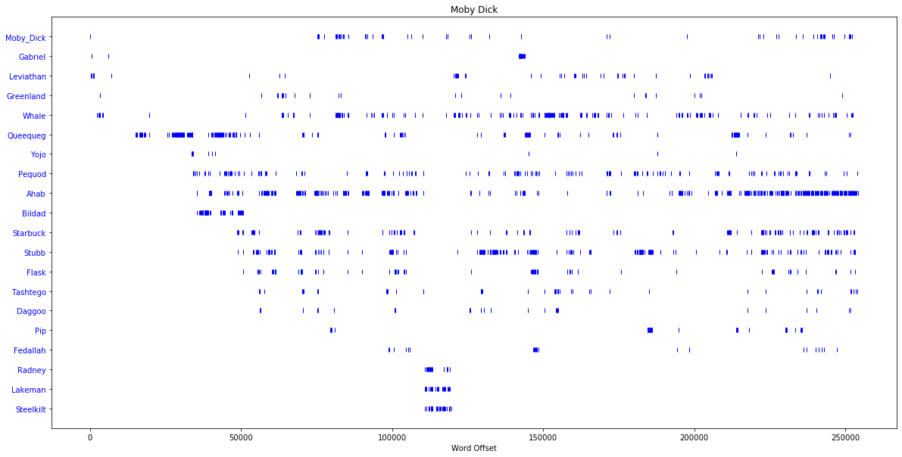
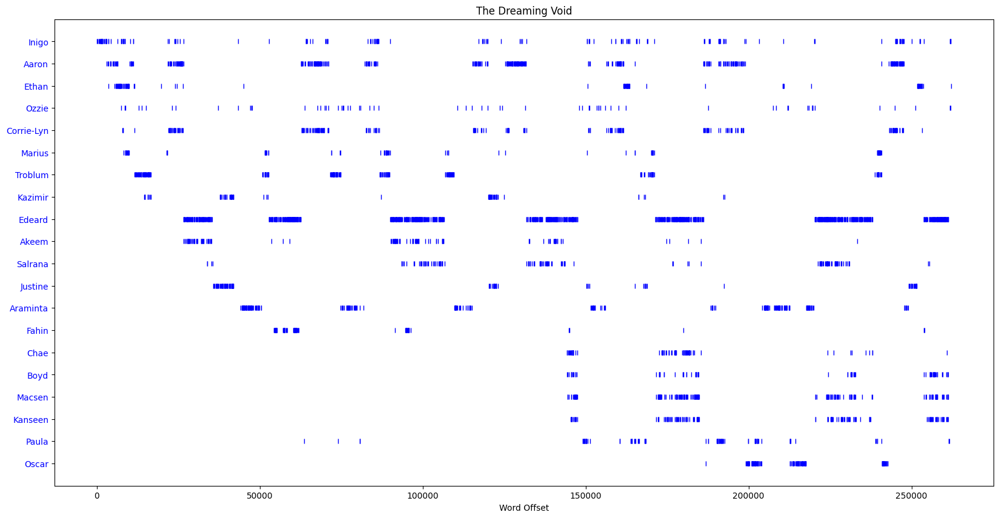

# Charactergraph

For e-book files create **'charactergrams'** as a graphical representation of novel characters occurence over time.

> [-gram](https://en.wiktionary.org/wiki/-gram): Something written, drawn or otherwise recorded. From Ancient Greek suffix -γραμμα (-gramma), from γράμμα (grámma, “written character, letter, that which is drawn”). [Source: [Wiktionary.org](https://en.wiktionary.org/wiki/-gram#Etymology)]

  
Figure: example charactergram for Moby Dick.

  
Figure: example charactergram for the sci-fi novel [The Dreaming Void](https://en.wikipedia.org/wiki/Void_Trilogy) by
Peter F. Hamilton.

## Motivation

Sometimes you probably want to know when and how often some novel characters are 'active'. This could give you
information on

- the importance of a character and its destiny
- how the novel progresses
- when a character is first or last seen/active
- in which chapters certain characters are active (mentioned)
- how some characters are linked to each other
- ...

Such an overview is especially helpful when listening to a comprehensive e-book (e.g., a big sci-fi space opera) with
lot's of characters and varying places, because it can give you clues when your beloved characters will be mentioned
again (or nevermore).

## Solution Approach

Build a 'charactergraph' or 'charactermeter' which records the 'activity' of all persons/characters in the novel and
outputs a 'charactergram'.

A **charactergram** depicts the dispersion of novel characters over time. This graphical representations shows when
which characters or persons occur in a novel (analogously to
a [lexical dispersion plot](https://duckduckgo.com/?t=canonical&q=lexical+dispersion+plot&iax=images&ia=images)).

The **x-axis** depicts the word number in the source text,  
the **y-axis** the n-th most common words.

This charactergraph-program outputs such a charactergram. The input is an EPUB file (.epub).

Charactergraph uses [NLP](https://en.wikipedia.org/wiki/Natural_language_processing) techniques to automatically
determine person names. The NLP pipeline is:

1. get the plain text of all chapters
2. text tokenization
3. part-of-speech (POS) tagging
4. named entity recognition (NER), filtering of person names
5. frequency counting
6. dispersion plot

The NLP Python libraries being used are [NLTK](https://www.nltk.org) and [Spacy](https://spacy.io).

## Prerequisites

- Python 3.6+

## Limitations

- Only for .epub files.
- Only for Englisch language.
   - Other languages could be supported, see [Spacy Models](https://spacy.io/models)

## Setup

1. Setup Python virtual environment (only once):
   `python3 -m venv venv`
2. Activate virtual environment:
   `source venv/bin/activate`
3. Install Python dependencies:
   `python3 -m pip install -r requirements.txt`

## How-to Run

1. Setup Python virtual environment (see setup)
2. Activate virtual environment:
   `source venv/bin/activate`
3. Run:
   `python3 charactergraph.py INPUT.epub --output=OUTPUT.png`

## License

AGPL3, see [LICENSE.md](LICENSE.md).
